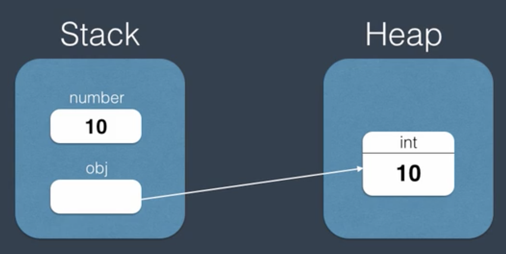

# OO Analysis and Design

## Inheritance (Is a)
- A car is a Vehicle.

#### Benefit
- Reused
- Polymorphism

#### Problem
- Large hierarchies
- Fragility
- Tightly-Coupling

## Composition (Has a)

- Relationship between two classes that allow one to contain the other.
- Ex:一個椅子(class)，會有椅背(class)、椅腳(class)、椅座(class
- Any inheritance can be translated into composition.

#### Benefit
- Resused
- Flexibility
- Lossly-Coupling

## Upcasting & Downcasting
- Upcasting is conversion from a derived class to a base class. （Implicit Casting)
- Downcasting is conversion from a base class to a derived class. Explicit Casting)
- 'as' keyword to convert. Once convert fail, it won't throw exception, while it will return null.
```csharp
    //It will throw InvalidCastException if conversion fail.
    Car BMW = (Car)obj;

    Car BMW = obj as Car;
    if(BMW != null)
    {
        .....
    }
```
- 'is' keyword to check if object is specific class.
```csharp
    if(obj is Car){
        Car BMW = (Car) obj;
    }
```

- 當使用Upcasting轉換成父類別時，object只能看到父類別的東西。因此如果要使用子類別自己宣告的東西，就必須downcasting。

## Boxing & Unboxing
- Value type store on stack, which keep short lifetime. (Struct is value type)
- Reference type store on heap which has large amount memory and keep long lifetime.
- This cause performaence penalty.
#### Boxing
- Boxing is the process of a value type to an object reference.
- Means that value type move from stack to heap.
```csharp
    object obj = 10;
```


#### Unboxing
- Means that we get new variable number on stack.
```csharp
    object obj = 10;
    int number = (int)obj;
```